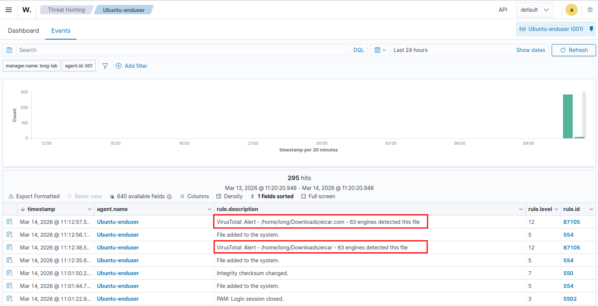
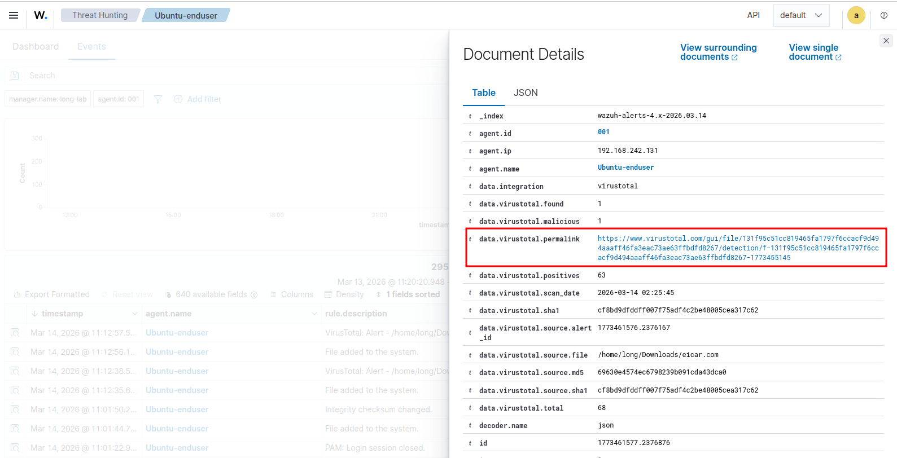

# VirusTotal Integration:
### Overview:
- Enables VirusTotal intergration into Wazuh server, requires VirusTotal’s API Key
- Wazuh Config file at: `/var/ossec/etc/ossec.conf`, add the VTs API Key syntax to the config file
___
Prerequisite:
* Initially, we need to create an account on VirusTotal:
  
  https://www.virustotal.com/gui/home/upload
  
* To acquire VirusTotal automation process connected to Wazuh, we find its API Key:

  
  
  
  
  For personal homelab, we are using default standard account which has limitation:
  
  * `4 lookups / min`
  * `500 lookups / day`
  
Now, we need to enable the VirusTotal integration into our Wazuh server:
* First, add the integration module to Wazuh server's main configuration file, at:
  ```bash
  /var/ossec/etc/ossec.conf
  ```
  ```xml
  <integration>
    <name>virustotal</name>
    <api_key>API_KEY</api_key> <!-- Replace with your VirusTotal API key -->
    <group>syscheck</group>
    <alert_format>json</alert_format>
  </integration>
  ```
  At `API_KEY` placeholder, replace it with our prior API KEY from VirusTotal

  Example:
  
  
  
  * Inside the `ossec.conf` file, move to the bottom within the first main `<ossec_config>...</ossec_config>` block
  * Add the config module above to that section and save the config file:
    
  

  * And restart the Wazuh-Manager to update the configuration file
  ```
  systemctl restart wazuh-manager
  ```
  

* To test out the VirusTotal Integration, we will download a `EICAR test file` on Ubuntu-enduser's machine:
  ```
  An EICAR file is a safe, standard text file created by the European Institute for Computer Antivirus Research (EICAR) to test antivirus software without using real malware, triggering a detection alert due to a specific    character string, proving your security software is active and working correctly
  ```
  On Ubuntu-enuser's machine:
  
  
  

  Back to our Wazuh server, we can confirm whether the event is triggered or not through alerts. Specifically, go to this page `Threat Hunting/Event`:

  

  Further inspecting the alert generated by the event, we can see more detailed information about the alert as well as a link to VirusTotal's analysis page:

  

  Following the provided URL, VirusTotal would present what detection it found with the `eicar` we previously installed on our enduser's machine:

  

  
  
  There are 63/68 vendors detected the suspicuous `eicar` file and flagged it

___
More related documentations at:
* Wazuh: https://documentation.wazuh.com/current/user-manual/capabilities/malware-detection/virus-total-integration.html
* VirusTotal: https://docs.virustotal.com/


